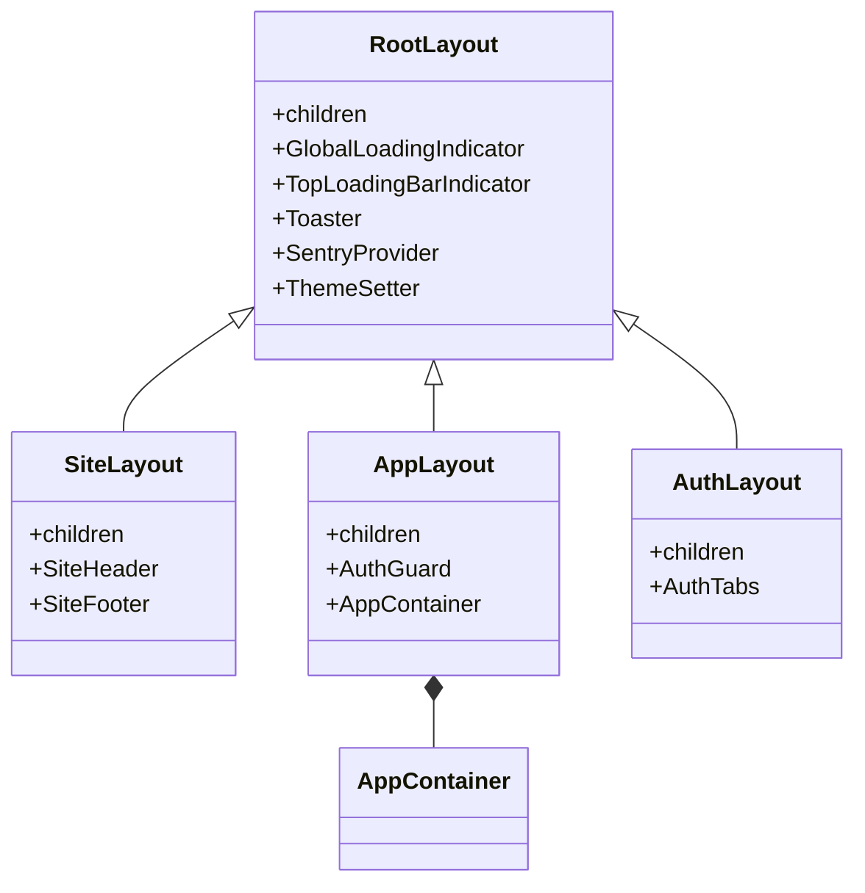
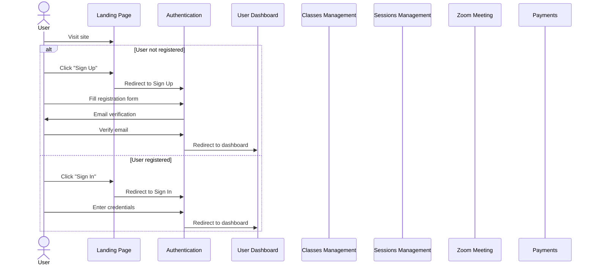

# Comma Education Application Structure

## Component Flow Diagram

```mermaid
graph TD
    Layout["App Layout"] --> SiteLayout["Site Layout"]
    Layout --> AppLayout["App Layout"]
    Layout --> AuthLayout["Auth Layout"]
    
    SiteLayout --> SitePages["Public Site Pages"]
    SitePages --> HomePage["Home Page"]
    SitePages --> PricingPage["Pricing Page"]
    SitePages --> SelfRegistration["Self Registration"]
    SitePages --> AboutPage["About Page"]
    SitePages --> BlogPage["Blog Page"]
    SitePages --> DocsPage["Docs Page"]
    SitePages --> FAQPage["FAQ Page"]
    
    AuthLayout --> AuthComponents["Auth Components"]
    AuthComponents --> SignIn["Sign In"]
    AuthComponents --> SignUp["Sign Up"]
    AuthComponents --> PasswordReset["Password Reset"]
    AuthComponents --> Callback["Auth Callback"]
    AuthComponents --> Verify["MFA Verification"]
    
    AppLayout --> AppComponents["App Components"]
    AppComponents --> AppContainer["App Container"]
    AppContainer --> AppHeader["App Header"]
    AppContainer --> AppSidebar["App Sidebar"]
    AppContainer --> AppRouteShell["App Route Shell"]
    
    AppSidebar --> AppSidebarNavigation["Sidebar Nav"]
    
    AppRouteShell --> Dashboard["Dashboard"]
    AppRouteShell --> Classes["Classes"]
    AppRouteShell --> Tutors["Tutors"]
    AppRouteShell --> UpcomingSessions["Upcoming Classes"]
    AppRouteShell --> PastSessions["Past Classes"]
    AppRouteShell --> Payments["Payments"]
    AppRouteShell --> Settings["Settings"]
    
    Dashboard --> RoleCheck{"User Role?"}
    RoleCheck -->|Admin| AdminDashboard["Admin Dashboard Components"]
    RoleCheck -->|Tutor| TutorDashboard["Tutor Dashboard Components"]
    RoleCheck -->|Student| StudentDashboard["Student Dashboard Components"]
    
    TutorDashboard --> TutorDashboardComponents["Tutor Dashboard"]
    TutorDashboardComponents --> TutorClassesView["Classes View"]
    TutorDashboardComponents --> TutorSessionsView["Sessions View"]
    TutorDashboardComponents --> TutorPaymentsView["Payments View"]
    
    StudentDashboard --> StudentDashboardComponents["Student Dashboard"]
    StudentDashboardComponents --> StudentClassesView["Classes View"]
    StudentDashboardComponents --> StudentSessionsView["Sessions View"]
    StudentDashboardComponents --> StudentPaymentsView["Payments View"]
    
    AppComponents --> SharedComponents["Shared Components"]
    SharedComponents --> ProfileAvatar["Profile Avatar"]
    SharedComponents --> ProfileDropdown["Profile Dropdown"]
    SharedComponents --> DarkModeToggle["Dark Mode Toggle"]
    SharedComponents --> GlobalLoadingIndicator["Global Loading Indicator"]
    SharedComponents --> TopLoadingBarIndicator["Top Loading Bar"]
    
    Classes --> ClassComponents["Class Components"]
    ClassComponents --> ClassList["Class List"]
    ClassComponents --> ClassDetails["Class Details"]
    ClassComponents --> ClassCreation["Class Creation"]
    
    UpcomingSessions --> UpcomingSessionComponents["Upcoming Session Components"]
    UpcomingSessionComponents --> SessionList["Session List"]
    UpcomingSessionComponents --> SessionDetails["Session Details"]
    
    SessionDetails --> ZoomComponents["Zoom Components"]
    ZoomComponents --> ZoomSession["Zoom Session"]
    
    SignIn --> AuthChangeListener["Auth Change Listener"]
    SignUp --> AuthChangeListener
    AuthChangeListener --> RoleCheck
    
    Payments --> PaymentComponents["Payment Components"]
    PaymentComponents --> PaymentsList["Payments List"]
    PaymentComponents --> PaymentDetails["Payment Details"]
    PaymentComponents --> StripeIntegration["Stripe Integration"]
```

## Component Hierarchy

```mermaid
classDiagram
    class RootLayout {
        +children
        +GlobalLoadingIndicator
        +TopLoadingBarIndicator
        +Toaster
        +SentryProvider
        +ThemeSetter
    }
    
    class SiteLayout {
        +children
        +SiteHeader
        +SiteFooter
    }
    
    class AppLayout {
        +children
        +AuthGuard
        +AppContainer
    }
    
    class AuthLayout {
        +children
        +AuthTabs
    }
    
    RootLayout <|-- SiteLayout
    RootLayout <|-- AppLayout
    RootLayout <|-- AuthLayout
    
    AppLayout *-- AppContainer
```

## User Flow Diagram

```mermaid
sequenceDiagram
    actor User
    participant LandingPage as Landing Page
    participant Auth as Authentication
    participant Dashboard as User Dashboard
    participant Classes as Classes Management
    participant Sessions as Sessions Management
    participant Zoom as Zoom Meeting
    participant Payments as Payments
    
    User->>LandingPage: Visit site
    
    alt User not registered
        User->>LandingPage: Click "Sign Up"
        LandingPage->>Auth: Redirect to Sign Up
        User->>Auth: Fill registration form
        Auth->>User: Email verification
        User->>Auth: Verify email
        Auth->>Dashboard: Redirect to dashboard
    else User registered
        User->>LandingPage: Click "Sign In"
        LandingPage->>Auth: Redirect to Sign In
        User->>Auth: Enter credentials
        Auth->>Dashboard: Redirect to dashboard
    end
``` 